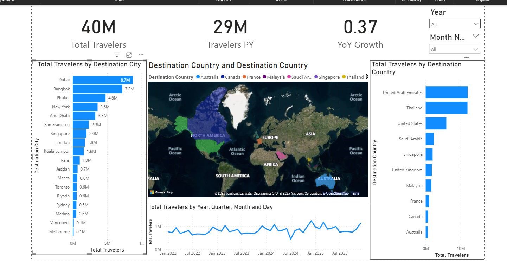

# 🌍 Indian Outbound Travel Dashboard

An interactive Power BI dashboard analyzing Indian outbound travel patterns, trends, and destinations.

## 📊 Project Overview

This Power BI dashboard provides comprehensive insights into:
- **Top destination countries** for Indian travelers
- **Most popular cities** within each country  
- **Monthly/Yearly travel trends** and seasonality
- **Year-over-Year growth analysis**
- **Interactive filtering** and drill-down capabilities

## 🚀 Features

- **Interactive World Map** - Visualize travel density by country
- **Dynamic Filtering** - Filter by year and month
- **Drill-through Analysis** - Click countries to see city-level data
- **Time Intelligence** - YoY growth calculations and trend analysis
- **Professional UI/UX** - Clean, business-ready visualizations

## 📈 Key Insights

- **UAE** (particularly Dubai) is the top destination
- **Thailand** follows as second most popular
- **December** shows highest travel volume (holiday season)
- **10% projected growth** for 2025
- Clear **seasonal patterns** visible in monthly trends

## 🛠️ Technical Stack

- **Power BI Desktop** - Data visualization & dashboard development
- **DAX** - Measures and time intelligence calculations
- **Power Query** - Data transformation and modeling
- **CSV** - Data source format

## 📁 Project Structure
